# 🧬 MorphML Complete Algorithm Diagrams
**Authors:** Vedanth ([@vedanthq](https://github.com/vedanthq)) & Eshan Roy ([@eshanized](https://github.com/eshanized))  
**Organization:** TONMOY INFRASTRUCTURE & VISION  
**Organization Description:** TIVerse — The innovation universe by Tonmoy Infrastructure & Vision, building open-source tools in AI, Cloud, DevOps, and Infrastructure.  
**Repository:** https://github.com/TIVerse/MorphML  
**Version:** 1.0  
**Last Updated:** October 31, 2025

---

## 📋 Table of Contents

1. [System Architecture](#1-system-architecture)
2. [Experiment Lifecycle](#2-experiment-lifecycle)
3. [DSL Compilation Flow](#3-dsl-compilation-flow)
4. [Evolutionary Algorithms](#4-evolutionary-algorithms)
5. [Bayesian Optimization](#5-bayesian-optimization)
6. [Gradient-Based NAS](#6-gradient-based-nas)
7. [Reinforcement Learning Search](#7-reinforcement-learning-search)
8. [Distributed Execution](#8-distributed-execution)
9. [Meta-Learning Pipeline](#9-meta-learning-pipeline)
10. [Model Graph Evolution](#10-model-graph-evolution)
11. [Multi-Objective Optimization](#11-multi-objective-optimization)
12. [Worker Execution Flow](#12-worker-execution-flow)
13. [Fault Tolerance & Recovery](#13-fault-tolerance--recovery)
14. [Caching & Performance](#14-caching--performance)
15. [Integration Adapters](#15-integration-adapters)

---

## 1. System Architecture

### High-Level System Overview


---

## 2. Experiment Lifecycle

### Complete Experiment Flow


### Detailed Search Loop


---

## 3. DSL Compilation Flow

### DSL to Executable Pipeline


### AST Processing Pipeline


---

## 4. Evolutionary Algorithms

### Genetic Algorithm Flow


### Selection Strategies


### Crossover Operations


### Mutation Operators


### Differential Evolution


### CMA-ES Algorithm

```mermaid
flowchart TD
    Start([Initialize CMA-ES]) --> SetParams[Set Parameters: μ, λ, σ]
    SetParams --> InitCov[Initialize Covariance Matrix]
    
    InitCov --> SampleLoop{Generation < Max?}
    SampleLoop -->|No| End([Return Best])
    SampleLoop -->|Yes| Sample[Sample λ individuals]
    
    Sample --> Evaluate[Evaluate Fitness]
    Evaluate --> SelectBest[Select μ best]
    SelectBest --> UpdateMean[Update Mean]
    UpdateMean --> UpdateCov[Update Covariance]
    UpdateCov --> UpdateStep[Update Step Size]
    UpdateStep --> SampleLoop
    
    style Start fill:#e1f5ff
    style End fill:#e1ffe1
    style Sample fill:#fff4e1
    style UpdateCov fill:#f0e1ff
```



---

## 5. Bayesian Optimization

### Bayesian Optimization Loop


### Gaussian Process Workflow


### Acquisition Functions


### Tree-Structured Parzen Estimator (TPE)

```mermaid
sequenceDiagram
    participant History
    participant TPE
    participant Optimizer
    
    loop Optimization Iterations
        TPE->>History: Get observations
        TPE->>TPE: Split by threshold γ
        TPE->>TPE: Build l(x) from good samples
        TPE->>TPE: Build g(x) from bad samples
        TPE->>Optimizer: Optimize EI = l(x)/g(x)
        Optimizer->>TPE: Return best x*
        TPE->>History: Evaluate f(x*)
    end
```



---

## 6. Gradient-Based NAS

### DARTS Architecture

```mermaid
flowchart TD
    Start([Start DARTS]) --> InitSupernet[Initialize Supernet]
    InitSupernet --> InitAlpha[Initialize Architecture Parameters α]
    
    InitAlpha --> BiLevel{Bi-level Optimization}
    
    BiLevel --> UpdateWeights[Update Weights w]
    UpdateWeights --> UpdateArch[Update Architecture α]
    UpdateArch --> CheckConverge{Converged?}
    
    CheckConverge -->|No| BiLevel
    CheckConverge -->|Yes| Discretize[Discretize Architecture]
    Discretize --> Retrain[Retrain from Scratch]
    Retrain --> End([Final Architecture])
    
    style Start fill:#e1f5ff
    style End fill:#e1ffe1
    style BiLevel fill:#fff4e1
    style Discretize fill:#f0e1ff
```



### Supernet Training

```mermaid
graph TB
    subgraph "Supernet Mixed Operations"
        Input[Input] --> Op1[Conv 3x3]
        Input --> Op2[Conv 5x5]
        Input --> Op3[Max Pool]
        Input --> Op4[Skip Connect]
        
        Op1 --> Weighted1[α₁ × Out₁]
        Op2 --> Weighted2[α₂ × Out₂]
        Op3 --> Weighted3[α₃ × Out₃]
        Op4 --> Weighted4[α₄ × Out₄]
        
        Weighted1 --> Sum[Σ]
        Weighted2 --> Sum
        Weighted3 --> Sum
        Weighted4 --> Sum
        
        Sum --> Output[Output]
    end
    
    style Input fill:#e1f5ff
    style Sum fill:#ffe1f5
    style Output fill:#e1ffe1
```



### ENAS Controller


---

## 7. Reinforcement Learning Search

### PPO-Based NAS


### Architecture Environment


### A3C Architecture Search

```mermaid
graph TB
    GlobalNet[Global Network] --> Worker1[Worker 1]
    GlobalNet --> Worker2[Worker 2]
    GlobalNet --> Worker3[Worker 3]
    GlobalNet --> WorkerN[Worker N]
    
    Worker1 --> Env1[Environment 1]
    Worker2 --> Env2[Environment 2]
    Worker3 --> Env3[Environment 3]
    WorkerN --> EnvN[Environment N]
    
    Env1 --> Gradient1[∇θ₁]
    Env2 --> Gradient2[∇θ₂]
    Env3 --> Gradient3[∇θ₃]
    EnvN --> GradientN[∇θₙ]
    
    Gradient1 --> GlobalNet
    Gradient2 --> GlobalNet
    Gradient3 --> GlobalNet
    GradientN --> GlobalNet
    
    style GlobalNet fill:#e1f5ff
    style Worker1 fill:#e1ffe1
    style Env1 fill:#fff4e1
```

---

## 8. Distributed Execution

### Master-Worker Architecture

```mermaid
graph TB
    subgraph "Master Node"
        Orchestrator[Orchestrator]
        Scheduler[Task Scheduler]
        ResultAgg[Result Aggregator]
        Monitor[Health Monitor]
    end
    
    subgraph "Worker Pool"
        Worker1[Worker 1]
        Worker2[Worker 2]
        Worker3[Worker 3]
        WorkerN[Worker N...]
    end
    
    subgraph "Shared Storage"
        ResultDB[(Result DB)]
        CheckpointFS[(Checkpoint Store)]
        Cache[(Artifact Cache)]
    end
    
    Orchestrator --> Scheduler
    Scheduler --> Worker1
    Scheduler --> Worker2
    Scheduler --> Worker3
    Scheduler --> WorkerN
    
    Worker1 --> ResultAgg
    Worker2 --> ResultAgg
    Worker3 --> ResultAgg
    WorkerN --> ResultAgg
    
    ResultAgg --> ResultDB
    
    Worker1 --> CheckpointFS
    Worker2 --> CheckpointFS
    Worker3 --> Cache
    WorkerN --> Cache
    
    Monitor --> Worker1
    Monitor --> Worker2
    Monitor --> Worker3
    Monitor --> WorkerN
    
    style Orchestrator fill:#e1f5ff
    style Worker1 fill:#e1ffe1
    style ResultDB fill:#ffe1f5
```

### Task Distribution Flow

```mermaid
sequenceDiagram
    participant Master
    participant Queue
    participant Worker1
    participant Worker2
    participant Storage
    
    Master->>Queue: Enqueue 100 tasks
    
    par Worker 1 Processing
        Queue->>Worker1: Dequeue task
        Worker1->>Worker1: Execute evaluation
        Worker1->>Storage: Save results
        Worker1->>Master: Report completion
    and Worker 2 Processing
        Queue->>Worker2: Dequeue task
        Worker2->>Worker2: Execute evaluation
        Worker2->>Storage: Save results
        Worker2->>Master: Report completion
    end
    
    loop Until queue empty
        Master->>Queue: Check status
    end
    
    Master->>Storage: Aggregate results
```

### Fault Tolerance Mechanism

```mermaid
flowchart TD
    WorkerStart([Worker Starts]) --> Heartbeat[Send Heartbeat]
    Heartbeat --> ProcessTask[Process Task]
    
    ProcessTask --> Checkpoint[Save Checkpoint]
    Checkpoint --> CheckHealth{Healthy?}
    
    CheckHealth -->|Yes| Heartbeat
    CheckHealth -->|No| Detect[Master Detects Failure]
    
    Detect --> Reassign[Reassign Task]
    Reassign --> LoadCheckpoint[Load Last Checkpoint]
    LoadCheckpoint --> Resume[Resume Execution]
    Resume --> ProcessTask
    
    ProcessTask --> Complete{Task Done?}
    Complete -->|No| Checkpoint
    Complete -->|Yes| Report[Report to Master]
    Report --> WorkerEnd([Worker Idle])
    
    style WorkerStart fill:#e1f5ff
    style Detect fill:#ffe1e1
    style Report fill:#e1ffe1
```

---

## 9. Meta-Learning Pipeline

### Overall Meta-Learning Flow

```mermaid
flowchart TD
    Start([New Task]) --> ExtractFeatures[Extract Meta-Features]
    ExtractFeatures --> QueryKB[Query Knowledge Base]
    
    QueryKB --> FindSimilar[Find Similar Tasks]
    FindSimilar --> RetrieveStrategies[Retrieve Strategies]
    
    RetrieveStrategies --> WarmStart[Generate Warm Start]
    WarmStart --> PredictPerf[Predict Performance]
    
    PredictPerf --> SelectStrategy[Select Best Strategy]
    SelectStrategy --> ExecuteSearch[Execute Search]
    
    ExecuteSearch --> UpdateKB[Update Knowledge Base]
    UpdateKB --> End([Return Results])
    
    style Start fill:#e1f5ff
    style End fill:#e1ffe1
    style QueryKB fill:#fff4e1
    style WarmStart fill:#f0e1ff
```

### Warm-Starting Process

```mermaid
sequenceDiagram
    participant NewTask
    participant MetaLearner
    participant KnowledgeBase
    participant Optimizer
    
    NewTask->>MetaLearner: Task description
    MetaLearner->>MetaLearner: Extract features
    MetaLearner->>KnowledgeBase: Query similar tasks
    KnowledgeBase->>MetaLearner: Return past experiments
    
    MetaLearner->>MetaLearner: Select relevant models
    MetaLearner->>MetaLearner: Adapt to new task
    MetaLearner->>Optimizer: Initialize population
    
    Optimizer->>Optimizer: Continue search
    Optimizer->>NewTask: Return best model
    NewTask->>KnowledgeBase: Store new experience
```

### Performance Prediction

```mermaid
graph TB
    subgraph "Feature Extraction"
        Architecture[Model Architecture] --> ArchFeatures[Architecture Features]
        Hyperparams[Hyperparameters] --> HPFeatures[HP Features]
        Dataset[Dataset Info] --> DataFeatures[Dataset Features]
    end
    
    ArchFeatures --> Encoder[Feature Encoder]
    HPFeatures --> Encoder
    DataFeatures --> Encoder
    
    Encoder --> Predictor[Neural Predictor]
    Predictor --> PerfEstimate[Performance Estimate]
    Predictor --> Uncertainty[Uncertainty Estimate]
    
    style Architecture fill:#e1f5ff
    style Predictor fill:#e1ffe1
    style PerfEstimate fill:#fff4e1
    style Uncertainty fill:#ffe1f5
```

### Strategy Evolution

```mermaid
flowchart TD
    Start([Start Strategy Evolution]) --> CollectHistory[Collect Strategy Performance]
    CollectHistory --> FeatureExtract[Extract Strategy Features]
    
    FeatureExtract --> BuildMeta[Build Meta-Model]
    BuildMeta --> EvaluateStrategies[Evaluate All Strategies]
    
    EvaluateStrategies --> SelectBest[Select Top Strategies]
    SelectBest --> Combine[Combine Strategies]
    Combine --> CreateNew[Create New Strategy]
    
    CreateNew --> TestNew[Test New Strategy]
    TestNew --> Compare{Better than Parent?}
    
    Compare -->|Yes| AddToPool[Add to Strategy Pool]
    Compare -->|No| Discard[Discard Strategy]
    
    AddToPool --> End([Updated Strategy Pool])
    Discard --> End
    
    style Start fill:#e1f5ff
    style End fill:#e1ffe1
    style BuildMeta fill:#fff4e1
    style CreateNew fill:#f0e1ff
```

---

## 10. Model Graph Evolution

### Graph Mutation Operations

```mermaid
flowchart LR
    subgraph "Original Graph"
        A1[Input] --> B1[Conv1]
        B1 --> C1[Conv2]
        C1 --> D1[Output]
    end
    
    subgraph "Add Node Mutation"
        A2[Input] --> B2[Conv1]
        B2 --> E2[New Layer]
        E2 --> C2[Conv2]
        C2 --> D2[Output]
    end
    
    subgraph "Remove Node Mutation"
        A3[Input] --> C3[Conv2]
        C3 --> D3[Output]
    end
    
    subgraph "Rewire Mutation"
        A4[Input] --> B4[Conv1]
        A4 --> C4[Conv2]
        B4 --> C4
        C4 --> D4[Output]
    end
    
    style A1 fill:#e1f5ff
    style E2 fill:#e1ffe1
    style C3 fill:#ffe1f5
    style A4 fill:#fff4e1
```

### Graph Crossover

```mermaid
graph TB
    subgraph "Parent 1"
        P1A[Input] --> P1B[Conv3x3]
        P1B --> P1C[MaxPool]
        P1C --> P1D[Output]
    end
    
    subgraph "Parent 2"
        P2A[Input] --> P2B[Conv5x5]
        P2B --> P2C[AvgPool]
        P2C --> P2D[Output]
    end
    
    subgraph "Offspring"
        O1A[Input] --> O1B[Conv3x3]
        O1B --> O1C[AvgPool]
        O1C --> O1D[Output]
    end
    
    P1B -.->|Inherit| O1B
    P2C -.->|Inherit| O1C
    
    style P1B fill:#e1f5ff
    style P2C fill:#ffe1f5
    style O1B fill:#e1ffe1
    style O1C fill:#e1ffe1
```

### Graph Compilation to Framework

```mermaid
flowchart TD
    GraphIR[Model Graph IR] --> Validate{Valid DAG?}
    
    Validate -->|No| Error[Compilation Error]
    Validate -->|Yes| SelectBackend{Target Backend}
    
    SelectBackend -->|PyTorch| PTCompiler[PyTorch Compiler]
    SelectBackend -->|TensorFlow| TFCompiler[TF Compiler]
    SelectBackend -->|JAX| JAXCompiler[JAX Compiler]
    
    PTCompiler --> PTModule[nn.Module]
    TFCompiler --> TFModel[keras.Model]
    JAXCompiler --> JAXModel[Flax Model]
    
    PTModule --> Executable[Executable Model]
    TFModel --> Executable
    JAXModel --> Executable
    
    style GraphIR fill:#e1f5ff
    style Executable fill:#e1ffe1
    style Error fill:#ffe1e1
```

---

## 11. Multi-Objective Optimization

### Pareto Front Evolution

```mermaid
flowchart TD
    Start([Start Multi-Objective]) --> InitPop[Initialize Population]
    InitPop --> EvaluateAll[Evaluate All Objectives]
    
    EvaluateAll --> CalcDominance[Calculate Dominance]
    CalcDominance --> AssignRank[Assign Pareto Ranks]
    AssignRank --> CalcCrowding[Calculate Crowding Distance]
    
    CalcCrowding --> Selection[Non-Dominated Sorting]
    Selection --> Reproduction[Generate Offspring]
    Reproduction --> EvaluateOff[Evaluate Offspring]
    
    EvaluateOff --> Combine[Combine Parents + Offspring]
    Combine --> NewRanking[Rank Combined Population]
    NewRanking --> SelectBest[Select Best N]
    
    SelectBest --> CheckTerm{Termination?}
    CheckTerm -->|No| Selection
    CheckTerm -->|Yes| ExtractPareto[Extract Pareto Front]
    ExtractPareto --> End([Return Pareto Set])
    
    style Start fill:#e1f5ff
    style End fill:#e1ffe1
    style CalcDominance fill:#fff4e1
    style ExtractPareto fill:#f0e1ff
```

### NSGA-II Algorithm

```mermaid
sequenceDiagram
    participant Population
    participant NSGAII
    participant Evaluator
    
    NSGAII->>Population: Initialize N individuals
    NSGAII->>Evaluator: Evaluate objectives
    
    loop Generation
        NSGAII->>Population: Non-dominated sorting
        NSGAII->>Population: Calculate crowding distance
        NSGAII->>Population: Tournament selection
        NSGAII->>Population: Crossover & mutation
        NSGAII->>Evaluator: Evaluate offspring
        NSGAII->>NSGAII: Combine parents + offspring
        NSGAII->>NSGAII: Sort and select best N
        NSGAII->>Population: Update population
    end
    
    NSGAII->>Population: Return Pareto front
```

### Dominance Relationships

```mermaid
graph TB
    subgraph "Objective Space"
        A[Solution A<br/>Acc: 0.95, Latency: 100ms]
        B[Solution B<br/>Acc: 0.90, Latency: 50ms]
        C[Solution C<br/>Acc: 0.85, Latency: 150ms]
        D[Solution D<br/>Acc: 0.92, Latency: 80ms]
    end
    
    A -.->|Dominates| C
    A -.->|Dominates| D
    B -.->|Dominates| C
    D -.->|Dominates| C
    
    A ---|Non-dominated| B
    A ---|Non-dominated| D
    B ---|Non-dominated| D
    
    style A fill:#e1ffe1
    style B fill:#e1ffe1
    style D fill:#fff4e1
    style C fill:#ffe1e1
```

---

## 12. Worker Execution Flow

### Single Worker Lifecycle

```mermaid
stateDiagram-v2
    [*] --> Idle
    
    Idle --> ReceiveTask: Task Assigned
    ReceiveTask --> ValidateTask
    
    ValidateTask --> ParseGraph: Valid
    ValidateTask --> ReportError: Invalid
    
    ParseGraph --> CompileModel
    CompileModel --> LoadData
    LoadData --> SetupTraining
    
    SetupTraining --> Training
    
    state Training {
        [*] --> ForwardPass
        ForwardPass --> BackwardPass
        BackwardPass --> UpdateWeights
        UpdateWeights --> Checkpoint
        Checkpoint --> CheckConvergence
        CheckConvergence --> ForwardPass: Continue
        CheckConvergence --> [*]: Converged
    }
    
    Training --> Evaluation
    Evaluation --> CollectMetrics
    CollectMetrics --> SaveResults
    SaveResults --> ReportComplete
    
    ReportComplete --> Idle
    ReportError --> Idle
```

### Model Training Pipeline

```mermaid
flowchart TD
    Start([Receive Model]) --> ParseGraph[Parse Model Graph]
    ParseGraph --> Compile[Compile to Backend]
    Compile --> InitWeights[Initialize Weights]
    
    InitWeights --> LoadData[Load Dataset]
    LoadData --> DataLoader[Create DataLoader]
    
    DataLoader --> TrainLoop{Epoch < Max?}
    TrainLoop -->|Yes| TrainBatch[Train Batch]
    TrainBatch --> ComputeLoss[Compute Loss]
    ComputeLoss --> Backward[Backward Pass]
    Backward --> UpdateParams[Update Parameters]
    
    UpdateParams --> ValidCheck{Validation?}
    ValidCheck -->|Yes| Validate[Run Validation]
    ValidCheck -->|No| SaveCheckpoint
    
    Validate --> SaveCheckpoint[Save Checkpoint]
    SaveCheckpoint --> TrainLoop
    
    TrainLoop -->|No| FinalEval[Final Evaluation]
    FinalEval --> CollectMetrics[Collect All Metrics]
    CollectMetrics --> End([Return Results])
    
    style Start fill:#e1f5ff
    style End fill:#e1ffe1
    style TrainBatch fill:#fff4e1
    style Validate fill:#f0e1ff
```

### GPU Resource Management

```mermaid
sequenceDiagram
    participant Worker
    participant GPUManager
    participant GPU
    participant TaskQueue
    
    Worker->>GPUManager: Request GPU
    GPUManager->>GPU: Check availability
    
    alt GPU Available
        GPUManager->>Worker: Allocate GPU
        Worker->>GPU: Load model
        Worker->>GPU: Execute training
        Worker->>GPU: Free memory
        Worker->>GPUManager: Release GPU
    else GPU Busy
        GPUManager->>TaskQueue: Queue task
        TaskQueue->>Worker: Wait
        Note over Worker,GPU: Worker blocks or processes CPU tasks
        GPUManager->>Worker: GPU now available
    end
```

---

## 13. Fault Tolerance & Recovery

### Checkpoint & Recovery System

```mermaid
flowchart TD
    Start([Task Starts]) --> LoadPrevious{Previous Checkpoint?}
    
    LoadPrevious -->|Yes| RestoreState[Restore State]
    LoadPrevious -->|No| InitFresh[Initialize Fresh]
    
    RestoreState --> Execute[Execute Computation]
    InitFresh --> Execute
    
    Execute --> PeriodicCheck{Checkpoint Interval?}
    PeriodicCheck -->|Yes| SaveCheckpoint[Save Checkpoint]
    PeriodicCheck -->|No| Continue[Continue Execution]
    
    SaveCheckpoint --> Continue
    Continue --> FailureCheck{Failure Detected?}
    
    FailureCheck -->|Yes| LoadPrevious
    FailureCheck -->|No| Complete{Task Complete?}
    
    Complete -->|No| Execute
    Complete -->|Yes| Cleanup[Cleanup Resources]
    Cleanup --> End([Task Finished])
    
    style Start fill:#e1f5ff
    style End fill:#e1ffe1
    style SaveCheckpoint fill:#fff4e1
    style FailureCheck fill:#ffe1e1
```

### Master Failure Recovery

```mermaid
sequenceDiagram
    participant Master
    participant Backup
    participant Workers
    participant Storage
    
    Master->>Storage: Periodic state backup
    Master->>Workers: Task assignments
    
    Note over Master: Master Crashes
    
    Backup->>Storage: Detect master failure
    Backup->>Storage: Load last state
    Backup->>Backup: Promote to master
    
    Backup->>Workers: Request status
    Workers->>Backup: Report current tasks
    
    Backup->>Backup: Reconcile state
    Backup->>Workers: Resume coordination
```

### Worker Failure Handling

```mermaid
flowchart TD
    MasterMonitor[Master Monitors Workers] --> HeartbeatCheck{Heartbeat OK?}
    
    HeartbeatCheck -->|Yes| MasterMonitor
    HeartbeatCheck -->|No| DetectFailure[Detect Worker Failure]
    
    DetectFailure --> MarkDead[Mark Worker as Dead]
    MarkDead --> GetTask[Get Failed Task]
    
    GetTask --> CheckCheckpoint{Checkpoint Exists?}
    CheckCheckpoint -->|Yes| LoadCheckpoint[Load Checkpoint]
    CheckCheckpoint -->|No| RestartFull[Restart from Beginning]
    
    LoadCheckpoint --> Reassign[Reassign to Available Worker]
    RestartFull --> Reassign
    
    Reassign --> NewWorker[New Worker Executes]
    NewWorker --> Success{Success?}
    
    Success -->|Yes| UpdateResults[Update Results]
    Success -->|No| RetryCheck{Retry < Max?}
    
    RetryCheck -->|Yes| Reassign
    RetryCheck -->|No| MarkFailed[Mark Task as Failed]
    
    UpdateResults --> MasterMonitor
    MarkFailed --> MasterMonitor
    
    style DetectFailure fill:#ffe1e1
    style UpdateResults fill:#e1ffe1
    style MarkFailed fill:#ffe1e1
```

---

## 14. Caching & Performance

### Multi-Level Caching Strategy

```mermaid
graph TB
    Request[Evaluation Request] --> L1Cache{L1: Memory Cache}
    
    L1Cache -->|Hit| ReturnL1[Return from L1]
    L1Cache -->|Miss| L2Cache{L2: Redis Cache}
    
    L2Cache -->|Hit| UpdateL1[Update L1]
    L2Cache -->|Miss| L3Cache{L3: Disk Cache}
    
    L3Cache -->|Hit| UpdateL2[Update L2]
    L3Cache -->|Miss| Compute[Compute Result]
    
    Compute --> StoreL3[Store in L3]
    StoreL3 --> StoreL2[Store in L2]
    StoreL2 --> StoreL1[Store in L1]
    
    ReturnL1 --> Response[Return Result]
    UpdateL1 --> Response
    UpdateL2 --> Response
    StoreL1 --> Response
    
    style Request fill:#e1f5ff
    style Response fill:#e1ffe1
    style ReturnL1 fill:#d4f4dd
    style Compute fill:#ffe1e1
```

### Result Deduplication

```mermaid
flowchart TD
    NewModel[New Model] --> HashGraph[Compute Graph Hash]
    HashGraph --> CheckCache{Hash in Cache?}
    
    CheckCache -->|Yes| RetrieveResult[Retrieve Cached Result]
    CheckCache -->|No| CheckSimilar{Similar Model?}
    
    CheckSimilar -->|Yes| Approximate[Use Approximate Result]
    CheckSimilar -->|No| FullEval[Full Evaluation]
    
    FullEval --> StoreResult[Store in Cache]
    StoreResult --> Return[Return Result]
    
    RetrieveResult --> Return
    Approximate --> Refine{Refinement Needed?}
    
    Refine -->|Yes| QuickEval[Quick Evaluation]
    Refine -->|No| Return
    
    QuickEval --> StoreResult
    
    style NewModel fill:#e1f5ff
    style Return fill:#e1ffe1
    style RetrieveResult fill:#d4f4dd
    style FullEval fill:#fff4e1
```

### Incremental Evaluation

```mermaid
sequenceDiagram
    participant Optimizer
    participant Cache
    participant Evaluator
    
    Optimizer->>Cache: Check if parent evaluated
    
    alt Parent exists
        Cache->>Optimizer: Return parent weights
        Optimizer->>Evaluator: Fine-tune from parent
        Note over Evaluator: Reduced training time
    else No parent
        Optimizer->>Evaluator: Train from scratch
    end
    
    Evaluator->>Cache: Store new weights
    Evaluator->>Optimizer: Return performance
```

---

## 15. Integration Adapters

### PyTorch Integration Flow

```mermaid
flowchart TD
    GraphIR[MorphML Graph] --> Adapter[PyTorch Adapter]
    
    Adapter --> ConvertLayers[Convert Layers to nn.Module]
    ConvertLayers --> BuildSequential[Build nn.Sequential]
    BuildSequential --> AddHooks[Add Forward Hooks]
    
    AddHooks --> InitOptimizer[Initialize Optimizer]
    InitOptimizer --> TrainingLoop[Training Loop]
    
    TrainingLoop --> Forward[Forward Pass]
    Forward --> Loss[Compute Loss]
    Loss --> Backward[Backward Pass]
    Backward --> Update[Update Weights]
    
    Update --> CheckDone{Converged?}
    CheckDone -->|No| Forward
    CheckDone -->|Yes| ExtractMetrics[Extract Metrics]
    
    ExtractMetrics --> ConvertBack[Convert to MorphML Result]
    ConvertBack --> Return[Return to Orchestrator]
    
    style GraphIR fill:#e1f5ff
    style Return fill:#e1ffe1
    style TrainingLoop fill:#fff4e1
```

### TensorFlow/Keras Integration

```mermaid
flowchart TD
    GraphIR[MorphML Graph] --> TFAdapter[TensorFlow Adapter]
    
    TFAdapter --> ParseLayers[Parse Layer Specs]
    ParseLayers --> BuildKeras[Build Keras Model]
    BuildKeras --> CompileModel[Compile Model]
    
    CompileModel --> SetCallbacks[Set Callbacks]
    SetCallbacks --> Fit[model.fit]
    
    Fit --> TensorBoard[TensorBoard Logging]
    Fit --> EarlyStopping[Early Stopping Check]
    
    EarlyStopping --> Continue{Continue?}
    Continue -->|Yes| Fit
    Continue -->|No| Evaluate[model.evaluate]
    
    Evaluate --> SaveModel[Save Model]
    SaveModel --> ExtractMetrics[Extract Metrics]
    ExtractMetrics --> Return[Return Results]
    
    style GraphIR fill:#e1f5ff
    style Return fill:#e1ffe1
    style Fit fill:#fff4e1
```

### Scikit-learn Pipeline Adapter

```mermaid
flowchart LR
    GraphIR[MorphML Graph] --> SklearnAdapter[Sklearn Adapter]
    
    SklearnAdapter --> ExtractSteps[Extract Pipeline Steps]
    ExtractSteps --> CreateTransformers[Create Transformers]
    CreateTransformers --> CreateEstimator[Create Estimator]
    
    CreateEstimator --> BuildPipeline[sklearn.Pipeline]
    BuildPipeline --> Fit[pipeline.fit]
    
    Fit --> CrossVal[Cross-Validation]
    CrossVal --> Predict[pipeline.predict]
    Predict --> Score[Calculate Scores]
    
    Score --> Return[Return Metrics]
    
    style GraphIR fill:#e1f5ff
    style Return fill:#e1ffe1
    style BuildPipeline fill:#fff4e1
```

---

## 16. Search Strategy Comparison

### Strategy Selection Decision Tree

```mermaid
flowchart TD
    Start([Select Strategy]) --> SearchSpace{Search Space Size}
    
    SearchSpace -->|Small < 1000| Exhaustive[Exhaustive Search]
    SearchSpace -->|Medium 1K-10K| BayesianOpt[Bayesian Optimization]
    SearchSpace -->|Large 10K-100K| Evolutionary[Evolutionary Algorithm]
    SearchSpace -->|Very Large > 100K| GradientBased[Gradient-Based NAS]
    
    Exhaustive --> GPUCheck{GPU Available?}
    BayesianOpt --> GPUCheck
    Evolutionary --> GPUCheck
    GradientBased --> GPUCheck
    
    GPUCheck -->|Yes| UseGPU[Enable GPU Training]
    GPUCheck -->|No| UseCPU[CPU Only]
    
    UseGPU --> Budget{Budget Type}
    UseCPU --> Budget
    
    Budget -->|Time Limited| FastStrategy[Use Early Stopping]
    Budget -->|Eval Limited| FullStrategy[Full Evaluation]
    Budget -->|Unlimited| OptimalStrategy[Optimal Configuration]
    
    FastStrategy --> Execute[Execute Search]
    FullStrategy --> Execute
    OptimalStrategy --> Execute
    
    Execute --> End([Return Results])
    
    style Start fill:#e1f5ff
    style End fill:#e1ffe1
    style Execute fill:#fff4e1
```

### Performance Characteristics

```mermaid
graph TB
    subgraph "Exploration vs Exploitation"
        RandomSearch[Random Search<br/>High Exploration]
        GridSearch[Grid Search<br/>Systematic]
        Bayesian[Bayesian Opt<br/>Balanced]
        Evolutionary[Evolutionary<br/>Adaptive]
        Gradient[Gradient NAS<br/>High Exploitation]
    end
    
    subgraph "Convergence Speed"
        Fast[Fast: Gradient, RL]
        Medium[Medium: Bayesian, TPE]
        Slow[Slow: Evolution, Random]
    end
    
    subgraph "Sample Efficiency"
        High[High: Bayesian, Meta]
        Med[Medium: Evolution]
        Low[Low: Random, Grid]
    end
    
    Bayesian -.-> Medium
    Bayesian -.-> High
    
    Gradient -.-> Fast
    Gradient -.-> Med
    
    Evolutionary -.-> Medium
    Evolutionary -.-> Med
    
    style Bayesian fill:#e1ffe1
    style Fast fill:#d4f4dd
    style High fill:#fff4e1
```

---

## 17. Visualization & Monitoring

### Real-Time Dashboard Architecture

```mermaid
flowchart LR
    subgraph "Backend"
        Orchestrator[Orchestrator]
        ResultDB[(Results DB)]
        WebSocket[WebSocket Server]
    end
    
    subgraph "Frontend"
        Dashboard[React Dashboard]
        GraphView[Graph Viewer]
        MetricsView[Metrics Panel]
        LiveMonitor[Live Monitor]
    end
    
    Orchestrator --> ResultDB
    ResultDB --> WebSocket
    WebSocket --> Dashboard
    
    Dashboard --> GraphView
    Dashboard --> MetricsView
    Dashboard --> LiveMonitor
    
    style Orchestrator fill:#e1f5ff
    style Dashboard fill:#e1ffe1
    style WebSocket fill:#fff4e1
```

### Convergence Visualization

```mermaid
flowchart TD
    ExperimentData[Experiment Data] --> ProcessMetrics[Process Metrics]
    ProcessMetrics --> ComputeStats[Compute Statistics]
    
    ComputeStats --> PlotConvergence[Plot Convergence]
    ComputeStats --> PlotPareto[Plot Pareto Front]
    ComputeStats --> PlotDistribution[Plot Distribution]
    
    PlotConvergence --> GenerateReport[Generate Report]
    PlotPareto --> GenerateReport
    PlotDistribution --> GenerateReport
    
    GenerateReport --> SaveHTML[Save HTML Report]
    GenerateReport --> ExportPDF[Export PDF]
    GenerateReport --> Dashboard[Send to Dashboard]
    
    style ExperimentData fill:#e1f5ff
    style GenerateReport fill:#e1ffe1
    style Dashboard fill:#fff4e1
```

---

## 18. Security & Authentication

### Authentication Flow

```mermaid
sequenceDiagram
    participant User
    participant API
    participant Auth
    participant DB
    participant Experiment
    
    User->>API: Login Request
    API->>Auth: Validate Credentials
    Auth->>DB: Check User
    DB->>Auth: User Valid
    Auth->>API: Generate JWT
    API->>User: Return Token
    
    User->>API: Submit Experiment (+ JWT)
    API->>Auth: Validate JWT
    Auth->>API: Token Valid
    API->>Experiment: Execute Experiment
    Experiment->>User: Return Results
```

### Multi-Tenant Isolation

```mermaid
flowchart TB
    subgraph "User A Namespace"
        ExpA[Experiments A]
        DataA[Data A]
        ModelsA[Models A]
    end
    
    subgraph "User B Namespace"
        ExpB[Experiments B]
        DataB[Data B]
        ModelsB[Models B]
    end
    
    subgraph "Shared Infrastructure"
        Workers[Worker Pool]
        Storage[Shared Storage]
    end
    
    ExpA --> Workers
    ExpB --> Workers
    
    Workers --> DataA
    Workers --> DataB
    
    Workers --> Storage
    
    style ExpA fill:#e1f5ff
    style ExpB fill:#ffe1f5
    style Workers fill:#fff4e1
```

---

## 19. Data Pipeline

### Dataset Processing Flow

```mermaid
flowchart TD
    RawData[Raw Dataset] --> Validate{Valid Format?}
    
    Validate -->|No| Error[Report Error]
    Validate -->|Yes| Preprocess[Preprocessing]
    
    Preprocess --> Normalize[Normalization]
    Normalize --> Augment[Augmentation]
    Augment --> Split[Train/Val/Test Split]
    
    Split --> Cache[Cache Processed Data]
    Cache --> DataLoader[Create DataLoader]
    
    DataLoader --> Distribute[Distribute to Workers]
    Distribute --> Training[Model Training]
    
    style RawData fill:#e1f5ff
    style Training fill:#e1ffe1
    style Error fill:#ffe1e1
```

---

## 20. Complete End-to-End Example

### Full System Flow - CIFAR-10 AutoML

```mermaid
sequenceDiagram
    participant User
    participant CLI
    participant DSL
    participant Orchestrator
    participant Workers
    participant Storage
    participant Dashboard
    
    User->>CLI: morphml run cifar10_search.py
    CLI->>DSL: Parse DSL
    DSL->>DSL: Compile to IR
    DSL->>Orchestrator: Create Experiment
    
    Orchestrator->>Orchestrator: Initialize GA Population
    
    loop For 100 Generations
        Orchestrator->>Workers: Distribute 50 models
        
        par Worker Execution
            Workers->>Workers: Train Model 1-10
            Workers->>Workers: Train Model 11-20
            Workers->>Workers: Train Model 21-30
            Workers->>Workers: Train Model 31-40
            Workers->>Workers: Train Model 41-50
        end
        
        Workers->>Storage: Save Checkpoints
        Workers->>Orchestrator: Return Results
        
        Orchestrator->>Orchestrator: Update Population
        Orchestrator->>Orchestrator: Generate Offspring
        Orchestrator->>Dashboard: Stream Progress
        Dashboard->>User: Show Live Updates
    end
    
    Orchestrator->>Storage: Save Best Models
    Orchestrator->>CLI: Return Results
    CLI->>User: Display Summary
```

---

## Summary Statistics

### Total Diagrams: 45+

| Category | Number of Diagrams |
|----------|-------------------|
| System Architecture | 3 |
| Experiment Lifecycle | 3 |
| DSL Compilation | 2 |
| Evolutionary Algorithms | 6 |
| Bayesian Optimization | 4 |
| Gradient-Based NAS | 3 |
| Reinforcement Learning | 3 |
| Distributed Execution | 4 |
| Meta-Learning | 4 |
| Model Graph Evolution | 3 |
| Multi-Objective | 3 |
| Worker Execution | 3 |
| Fault Tolerance | 3 |
| Caching & Performance | 3 |
| Integration Adapters | 3 |
| Monitoring & Viz | 2 |
| Security | 2 |
| Data Pipeline | 1 |
| End-to-End | 1 |

---

## Usage Guide

### How to Use These Diagrams

1. **For Developers**: Use component diagrams to understand module interactions
2. **For Architects**: Use system diagrams for high-level design decisions
3. **For Documentation**: Embed in technical specifications and API docs
4. **For Presentations**: Extract relevant diagrams for stakeholder communication
5. **For Onboarding**: New team members can follow flow diagrams to understand the system

### Rendering

All diagrams are in Mermaid.js format and can be rendered in:
- GitHub Markdown (native support)
- GitLab (native support)
- VS Code (with Mermaid extension)
- Documentation sites (Sphinx, MkDocs, Docusaurus)
- Online editors (mermaid.live)

---

**Document Maintained By**: Vedanth & Eshan Roy (TONMOY INFRASTRUCTURE & VISION)  
**Last Updated**: November 11, 2024  
**Next Review**: January 31, 2025

---

*These diagrams are living artifacts and will evolve as MorphML develops.*