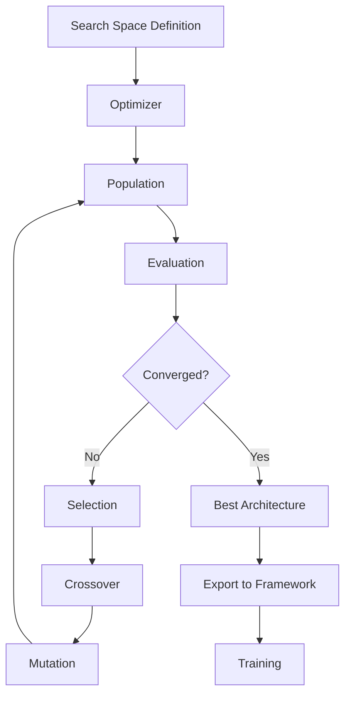

# MorphML Documentation

Welcome to **MorphML** - a production-grade Neural Architecture Search (NAS) framework with distributed optimization and meta-learning capabilities.

## 🚀 Quick Start

```bash
# Install MorphML
pip install morphml

# Run your first NAS experiment
morphml quickstart cnn_classification
```

## ✨ Key Features

- **🧬 Flexible Search Spaces** - Define architectures with pythonic DSL
- **⚡ Multiple Optimizers** - Genetic, Bayesian, Random, Hill Climbing, and more
- **🎯 Multi-Objective** - Optimize for accuracy, latency, parameters simultaneously
- **📊 Rich Visualization** - Interactive dashboards and professional diagrams
- **🌐 Distributed** - Scale across multiple GPUs and nodes
- **🔌 Extensible** - Plugin system for custom optimizers and evaluators
- **📦 Framework Integrations** - PyTorch, TensorFlow, JAX, Scikit-learn

## 📖 Documentation Structure

<div class="grid cards" markdown>

-   :material-clock-fast:{ .lg .middle } __Getting Started__

    ---

    Install MorphML and run your first experiment in 5 minutes

    [:octicons-arrow-right-24: Quickstart](getting-started/quickstart.md)

-   :material-book-open-variant:{ .lg .middle } __User Guide__

    ---

    Comprehensive guides for all features

    [:octicons-arrow-right-24: User Guide](user-guide/search-spaces.md)

-   :material-code-braces:{ .lg .middle } __API Reference__

    ---

    Complete API documentation with examples

    [:octicons-arrow-right-24: API Reference](api-reference/core/search-spaces.md)

-   :material-school:{ .lg .middle } __Tutorials__

    ---

    Step-by-step tutorials for common tasks

    [:octicons-arrow-right-24: Tutorials](tutorials/cifar10-nas.md)

</div>

## 🎯 Example

```python
from morphml.core.dsl import Layer, SearchSpace
from morphml.optimizers import GeneticAlgorithm
from morphml.evaluation import HeuristicEvaluator

# Define search space
space = SearchSpace("cifar10_search")
space.add_layers(
    Layer.input(shape=(3, 32, 32)),
    Layer.conv2d(filters=[32, 64], kernel_size=3),
    Layer.relu(),
    Layer.maxpool(pool_size=2),
    Layer.flatten(),
    Layer.dense(units=[128, 256]),
    Layer.dense(units=10),
)

# Run NAS
optimizer = GeneticAlgorithm(space, config={
    'population_size': 20,
    'num_generations': 50
})

best = optimizer.optimize(HeuristicEvaluator())
print(f"Best architecture fitness: {best.fitness:.4f}")

# Export to PyTorch
from morphml.integrations import PyTorchAdapter
adapter = PyTorchAdapter()
model = adapter.build_model(best.graph)
```

## 🏗️ Architecture



## 📊 Performance

| Optimizer | CIFAR-10 Accuracy | Search Time | GPU Memory |
|-----------|-------------------|-------------|------------|
| Genetic Algorithm | 94.2% | 2.5 hours | 8 GB |
| Bayesian Optimization | 93.8% | 3.1 hours | 6 GB |
| Random Search | 91.5% | 1.8 hours | 4 GB |

## 🌟 Highlights

### Phase 1-4: Core Features
- ✅ Complete NAS framework with multiple optimizers
- ✅ Constraint system for architecture validation
- ✅ Progress tracking and checkpointing
- ✅ Architecture comparison and validation utilities

### Phase 5: Ecosystem
- ✅ Web dashboard with real-time monitoring
- ✅ REST API with authentication and rate limiting
- ✅ Framework integrations (PyTorch, TensorFlow, JAX)
- ✅ Interactive visualizations and professional diagrams
- ✅ Plugin system for extensibility

## 🤝 Community

- **GitHub**: [TIVerse/MorphML](https://github.com/TIVerse/MorphML)
- **PyPI**: [morphml](https://pypi.org/project/morphml/)
- **Docker**: [tiverse/morphml](https://hub.docker.com/r/tiverse/morphml)
- **Issues**: [Report bugs](https://github.com/TIVerse/MorphML/issues)
- **Discussions**: [Ask questions](https://github.com/TIVerse/MorphML/discussions)

## 📝 Citation

If you use MorphML in your research, please cite:

```bibtex
@software{morphml2024,
  title = {MorphML: Production-grade Neural Architecture Search},
  author = {Vedanth and Roy, Eshan},
  organization = {TONMOY INFRASTRUCTURE & VISION},
  year = {2024},
  url = {https://github.com/TIVerse/MorphML}
}
```

## 📄 License

MorphML is released under the [MIT License](about/license.md).

## 🙏 Acknowledgments

Built with ❤️ by [TONMOY INFRASTRUCTURE & VISION](https://github.com/TIVerse)

Special thanks to all [contributors](about/authors.md) who have helped make MorphML better!

---

**Ready to get started?** Check out the [Quickstart Guide](getting-started/quickstart.md)!
